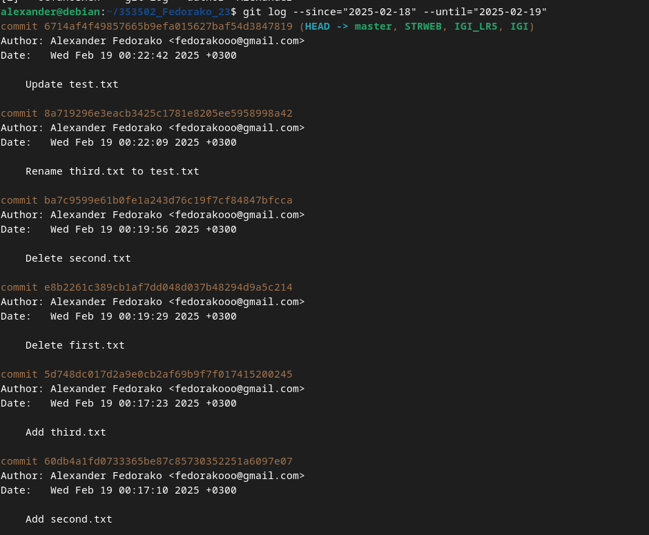
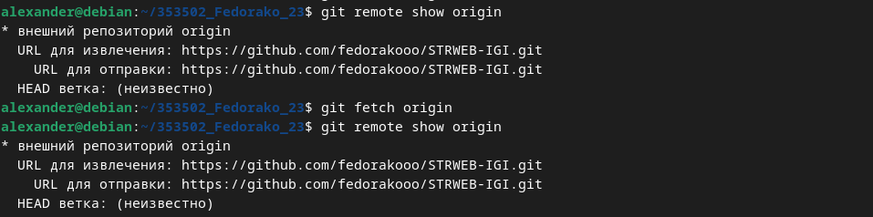

# Git: Основные операции

**Выполнил:** Федорако Александр  

**Группа:** 353502  

**Вариант:** 23 

## 1. Выполните базовую настройку

## 2. Создайте структуру папок и файлов

## 3. Создайте репозиторий внутри папки LR1 с помощью клонирования проект

## 4.1 Сделайте индексацию нескольких файлов в вашем Git-репозитории

## 4.2 Внесите изменения в файлы

## 4.3 Выполните коммиты к проиндексированным файлам

## 4.4 Добавьте и удалите файлы (один и группу файлов с определенным расширением)

## 4.5 Переименуйте файлы

## 4.6 Создайте для IGI и STRWEB, а также для каждой ЛР, вложенной в них, отдельные ветки, переместите папки и файлы на соответствующие ветки

## 4.7 Выведите историю коммитов (полностью и с определенными условиями)

## 4.8 Исследуйте флаги для git log

## 4.9 Создайте новый файл test.txt и вставьте в него строчку с номером варианта. Затем сделайте коммит и отмените его.

## 4.10 Проиндексируйте файл в вашем Git-репозитории, затем отмените его индексацию

## 4.11 Внесите изменения в файл в вашем Git-репозитории и затем верните его в исходное состояние

## 5.1 Создайте удаленный репозиторий

## 5.2 Просмотрите информацию о нем, обновите и опять просмотрите

## 5.3 Измените несколько файлов в вашем проекте и перенесите их в удаленный репозиторий

## 5.4 Создайте дополнительную ветку 1 в удаленном реппозитории, перенесите в нее два файла из другой ветки, удалите один из файлов

## 5.5 Создайте дополнительную ветку 2 в удаленном реппозитории, перенесите в нее два файла из вашего проекта, слить изменения в основную ветку, удалить дополнительную ветку 2

